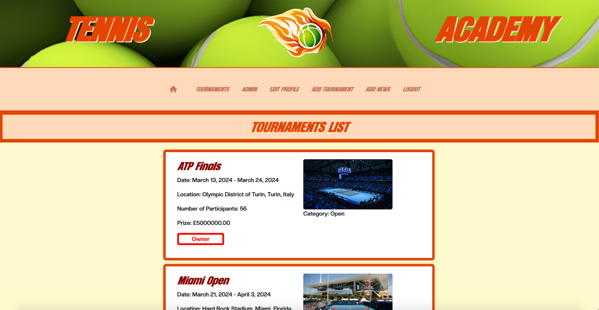

# [FIRE TENNIS ACADEMY](https://tennis-academy-05aa7afa19fa.herokuapp.com/)

The Tennis Academy is a functional and educational platform that allows tennis lovers to share and exchange their passion for the game. Users can create their own unique member profiles to personalize their experience, connect with fellow players, and view relevant news updates. By offering users exposure to recent and upcoming tournaments, the Tennis Academy platform also facilitates tournament entry and tracking for players of varying skill levels. 


## UX

In designing this website, I wanted to highlight my enthusiasm for tennis by creating a platform that highlights the sport's most important features. Especially more junior tennis players could truly benefit from the Tennis Academy platform, as it supplies the knowledge, community, and support needed in the early stages of joining the sport. 


### Landing Page

The platform's landing page serves to outline the Tennis Academy’s purpose and display exciting and relevant news snippets and updates about the world of tennis. Users can easily navigate the website via the burger button in order to view other pages and access registration and login.

### Tournaments Page

The tournaments page, which can be accessed via the burger button, presents the most important upcoming tournaments. It includes a brief description of each tournament's history, dates, location, number of participants, surface of court, entry fee, prize money, sponsor, category, and number of players. When accessing the tournaments directly, users can find contact details for easy registration. 


### Registration and login pages
The registration and login pages welcome and guide users in the creation and usage of their unique member profiles. 

### Colour Scheme

The theme of orange, yellow, and light pastel colors helps accentuate the decorative tennis-themed header. Incorporating contrast in background and text colors was a helpful and fun stylistic tool to enhance user experience. The chosen [Color Palette](https://coolors.co/e24502-ffdab9-870703-d30cd5-860701 "Color Palette") was:


- `#e24502` used for h1, borders, news, and tournaments text.
- `#ffdab9` used for the overall background.
- `#870703` used for title of news and tournaments.
- `#D30CD5` used for the profile user content.

- `blue` used for contact details.
- `black` used for text on tournaments page.
- `rgba(134, 7, 1, 0.5)` used for the navigation bar colours.


### Font families used

- Nike was used for the primary headers and titles.

- Luxia was used for all tournament descriptions

- Font Awesome icons were used for the icons for the home button, collapsible navigation bar, and footer.

## User Stories

### Site User

- As a site user I want to be able to create my own account so I can join the academy.
- As a site user I want to be able to edit my profile so I can add my details.
- As a site user I want to be able to see new content regularly so I can keep my interest.
- As a general user I can view the NavBar on every page so I can quickly access all parts of the site.
- As a site user, I want to see all the upcoming tournaments so that I can inform myself.
- As a site user I want to be able to edit my profile so I can add my details.
- As a certain type of user, I want to know what features are available to me, so that I can use them.
- As a site user, I want an account so that I can manage my registrations.

### Staff User

- As a content media manager I want to be able to display interesting upcoming news and events so I can keep people updated.
- As a Staff user, I want to be able to create a tournament to attract players to upcoming tournaments.
- As a Staff user, I want to be able to delete tournaments to keep the page updated.
- As a Staff user, I want to be able to delete tournaments to keep the page updated.
- As a Staff User, I want to be able to edit my created tournaments so that I can keep people up to date with the changes.
- As a creator of a piece of News, I want to be able delete news, to make sure the content is updated.
- As the author of a piece of news, I want to be able to modify it in case there is a mistake.

### Site Admin

- As a site owner, I want to be able to regulate content, so that I can decide what is posted on the website.
- As a site owner, I want a recognisable branding logo so my users can recognise the academy.
- As a site owner, I want to limit access to certain sections of the website, so that it cannot be modified freely.

## Wireframes
To ensure that best practices were carried out, [Balsamiq](https://balsamiq.com/wireframes)  was used to make the wireframe designs.

### Home Page (Logged in/Logged Out)
  

### Tournaments Page
  

### Profile Page
  

### Edit Profile Page
  

### Add News and Tournament Pages
  
  

### Log in and Log Out Pages
  
  

## Features of the Site Project

### Available current Features

- Allauth package was used as authentication system for the website.

#### HEADER AND NAVIGATION BAR

    - Header provides a clear name and logo design for the tennis academy.
    - Navigation bar provides all the links and features available to each corresponding user.
    - Navigation bar is displayed on all pages for easy access.


As it can be seen from both images, there's a difference between a logged in(staff user) and logged out user. It is necessary to be logged in to access different features.
#### FOOTER 

    - Provides another logo for the academy.
    - Displays my LinkedIn and GitHub.
    - Displayed on all pages.


#### Landing Page

    - The landing page welcomes the users with information on what to expect and recent developments.
	  - The navigation bar allows the user to log in and register as well as see all the upcoming tournaments.
	  - If logged in, depending on user or staff, the navigation will have more or less features.
	  - Users can click on each news snippet to view more details. If the user is classified as a staff user, they have editing rights of the pieces of news that they drafted.
		  - Staff / Normal User


       As it can be seen from both pictures, the navigation bar changes depending on the type of user.
  
#### Tournaments page
	- Users can view all available and upcoming tournaments with a brief description attached for each tournament.

  
  
  
	- Users can click on each tournament to view more details. If the user is classified as a staff user, they have editing rights of the tournament posting that they drafted. On the tournaments page, there's also a distinction between of who is the creator marked as owner if the logged user is the same as the creator, and also who is the creator if logged in user is not the creator. 

  
  


#### Profile Page/Edit Profile Page
	- Users can view what information they have available on their current profile
	- Users can edit the information available on their current profile.


#### Add Tournament/Add News Page
	- Both pages provide a form with their respective fields to add and create.
	- The news will be moderated by the admin user to ensure quality posts.
  - Both forms will be exactly as the edition forms as only the value of the fields need to be modified for edition.


#### Delete Tournament/Delete News Page
      - News and Tournaments can also be deleted. The once clicked on delete on the respectives news or tournament page, it will prompt a message to make sure the decision is correct. This feature is only availabe for the creator.
  
  

#### Log out Page
	- This page provides a clear message to allow the user to log out.

#### Log In / Register Page
	- Both pages used Allauth as a sign in and registration method. Thus, the template was derived from the built in system.
	- Users must create an account to see their profile.
	- Staff users must log in to add, edit, and delete news and tournaments.


### Restriction
      - If a user is trying to access a URL to which they have no permission, the website will send them an error, or redirect them to another website.

#### Future Features that might be added.

    - Tournament Registration
        - The players will be able to register and unregister to a tournament with a cut off date.
      - Players will be able to filter tournaments by category and date.
    - Academy Details
      - Although essential, this page has not yet been created due to time constraints. This page will have extra information about the academy.

## Utilised technologies and tools for the project
1. Balsamiq - Wireframing tool.
2. Bootstrap - Front-end CSS framework.
3. ChatGPT - Support tool for programming.
4. CSS - Main site design language.
5. DeepAI - Creation of Logo
6. Django - Python web framework.
7. ElephantSQL - Postgres database service.
8. Font Awesome - Icon library.
9. Git - Version control system.
10. GitHub - Online code repository platform.
11. Gitpod - Online IDE.
12. Heroku - Cloud platform for hosting web applications.
13. HTML - Main site content language.
14. JavaScript - Client-side scripting language.
15. Python - Back-end programming language.
16. WhiteNoise - Static file serving library.

## Packages installed on Django
- asgiref==3.7.2
- cloudinary==1.39.0
- crispy-bootstrap4==2024.1
- dj-database-url==0.5.0
- dj3-cloudinary-storage==0.0.6
- Django==4.2.11
- django-allauth==0.57.2
- django-bootstrap4==24.1
- django-crispy-forms==2.1
- django-extensions==3.2.3
- django-phonenumber-field==7.3.0
- django-summernote==0.8.20.0
- gunicorn==20.1.0
- oauthlib==3.2.2
- phonenumbers==8.13.32
- psycopg==3.1.18
- pygraphviz==1.12
- PyJWT==2.8.0
- python3-openid==3.2.0
- requests-oauthlib==1.4.0
- sqlparse==0.4.4
- urllib3==1.26.18
- whitenoise==5.3.0


## Database Mapping
Before starting the development, it is always good practice to map and design the database ERD, thus helping in the understanding and correlation of the different models.

```python
#STATUS will define the options for the different categories
STATUS = ((1, "8U"), (2, "10U"), (3, "11U"), (4, "12U"), (5, "14U"), (6, "16U"), (7, "18U"), (8, "Open"))
# Create your models here.
class WebUser(models.Model):
    """
    Stores a single user for the website, either staff or player
    """

    user = models.OneToOneField(User, on_delete=models.CASCADE)
    first_name = models.CharField(max_length=50)
    last_name = models.CharField(max_length=50)
    description = models.CharField(max_length=300)
    # tournament = models.ManyToManyField(Tournament, related_name="playing-tournaments", blank=True)
    created_on = models.DateTimeField(auto_now_add=True)
    updated_on = models.DateTimeField(auto_now=True)
    # photo_url = models.CharField(max_length=500, blank=True)
    # photo = CloudinaryField('image', default='placeholder', blank=True)
    category = models.IntegerField(choices=STATUS, blank=True, null=True)

    def __str__(self):
        return f"{self.first_name} {self.last_name} - {self.user}"


#This is the tournament model
class Tournament(models.Model):
"""
This model defines all the parameters for all the tournaments
"""
    name = models.CharField(max_length=100, unique=True)
    creator = models.ForeignKey(User, on_delete=models.CASCADE)
    start_date = models.DateField()
    end_date = models.DateField()
    location = models.CharField(max_length=200)
    surface = models.CharField(max_length=200)
    entry_fee = models.DecimalField(max_digits=10, decimal_places=2)
    prize_money = models.DecimalField(max_digits=10, decimal_places=2)
    sponsor = models.CharField(max_length=50)
    description = models.TextField(max_length=400)
    participants = models.ManyToManyField(WebUser, related_name="participatiing", blank=True)
    created_on = models.DateTimeField(auto_now_add=True, null=True)
    updated_on = models.DateTimeField(auto_now=True, null=True)
    max_participants = models.IntegerField()
    category = models.IntegerField(choices=STATUS, blank=True, null=True)
    img_url = CloudinaryField('image')
    phone_number = PhoneNumberField()
    email = models.EmailField()

    class Meta:
        ordering = ["start_date"]
        # permissions = [
        #     ("add_tournament", "Can add tournament"),
        #     # ("change_tournament", "Can change tournament"),
        #     # ("delete_tournament", "Can delete tournament"),
        # ]

    def __str__(self):
        return f"{self.name} starts on {self.start_date} and ends on {self.end_date}, played on {self.surface} | sponsored by {self.sponsor}"
    
    def number_particitipating(self):
        return self.participants.count()

OPTIONS = ((0,"Draft"), (1, "Published"))
"""This model defines all parameters for the news."""
class New(models.Model):
    title = models.CharField(max_length=200, unique=True)
    creator = models.ForeignKey(User, on_delete=models.CASCADE)
    content = models.TextField(max_length=1000)
    created_on = models.DateTimeField(auto_now_add=True, null=True)
    updated_on = models.DateTimeField(auto_now=True, null=True)
    status = models.IntegerField(choices=OPTIONS, default=0)
    img_url = CloudinaryField('image')

    class Meta:
        ordering = ["updated_on"]

    def __str__(self):
        return f"{self.title} was created on {self.created_on}. Last update {self.updated_on}"
```

By doing some research online, I came across [pygraphviz](hthttps://django-extensions.readthedocs.io/en/latest/graph_models.htmltp:// "pygraphviz") and django extensions that allowed me to plot the ERD automatically, thus also making a clearer and more precise diagram.


## Agile Development Methodology
### GitHub
#### GitHub Projects

For this project, [GitHub Projects](https://github.com/users/bvelizmera/projects/3) was used as an Agile tool for this capstone project. Through the use of its interface it was possible to create a [Kanban board](https://www.atlassian.com/agile/kanban/boards#:~:text=A%20kanban%20board%20is%20an,order%20in%20their%20daily%20work.// "Kanban board"), thus allowing tracking of specifics tasks that must be completed.


#### GitHub Issues
GitHub Issues allowed me to use my template for user stories and thus manage the different user stories to tackle the specific tasks in hand and helping set goals.
There, I used my own **User Story Template** to manage user stories.


### MoSCoW method

The user stories were done and priotirised using this method, thus ensuring a successful product while also assuring quality and delivering features that add value to the development of the project.

## Testing
The testing can be seen on: [TESTING.md](TESTING.md) 


## Deployment
The final version and live site of this project was deployed on [Heroku](https://www.heroku.com/ "Heroku") working together with GitHub to carry out the version control. 

To mirror the creation of this project, it is necessary to carry out the following steps:
1. Create an account on Heroku.
2. Create a new app choosing the correct region to.
3. Go to the settings tab of the new said chosen app and reveal config vars. These values are necessary and must match the values that you set on the project and your `env.py`. They are as follows:
	- SECRET_KEY
	- DATABASE_URL
	- CLOUDINARY_URL

4. GitHub account and repository must be linked together with Heroku to ensure a succesful deployment. [Here](https://devcenter.heroku.com/articles/github-integration "Here") is the documentation.

5. Correct GitHub repository of the project must be selected

6. For a safer deployment, select manual deploy from branch, thus allowing to decide when to deploy the site.

7. The [app](https://tennis-academy-05aa7afa19fa.herokuapp.com/ "app") should be available now.
**Important:
	All packages on requirements.txt must be installed on Django using the command line ` pip install -r requirements.txt`
	Although whitenoise is installed to collectstatic files, it is advisable to collectstatic files manually to ensure a successful deployment. The command line is `python3 manage.py collectstatic`.
**
## Credits
#### Content: 
- Navbar inspired by [MrPirrera](https://codepen.io/pirrera/pen/gOKBPK "MrPirrera") on CODEPEN
- Written content for the News and Tournaments was generated by [ChatOpenAI](https://chat.openai.com)
- Website style inspired by [RafaNadalAcademy](https://www.rafanadalacademy.com/en "RafaNadalAcademy")
- The logo images were gerenated by [DeepAI](https://deepai.org/machine-learning-model/text2img "DeepAI")
- As a support tool when developing the models, forms and views.py [ChatGPT](https://chat.openai.com "ChatGPT") was used to understand, explain and facilitate the work.

### Media:
- The icons in the header and footer were taken from [Font Awesome](https://fontawesome.com/)
- All images used on this project are not original but added from different media sources. All credit goes to their original creators
- Fonts used were [Nike Font](https://www.fontbolt.com/font/nike-font/ "Nike's Font"), [Luxia](https://font.download/font/luxia "Luxia") and [CreatoDisplay](https://www.dafont.com/es/creato-display.font "CreatoDisplay") . However, other fonts were added to CSS file as possible alternatives when testing. All credit goes to their original creators.

- [Favicon](https://www.iconarchive.com/show/sport-icons-by-icons-land/Tennis-Ball-icon.html) image from iconarchive. 

