# TESTING
 
## Functional Testing
Different features were tested during this process and the results can be observed on table 1.

 
 - Table 1

## Code Validation

### HTML

As recommended, [HTML W3C Validator](https://validator.w3.org) was used to validate HTML files.

| Directory | File | Screenshot | Notes |
| --- | --- | --- | --- |
| tournament/templates/tournament | new_list.html | 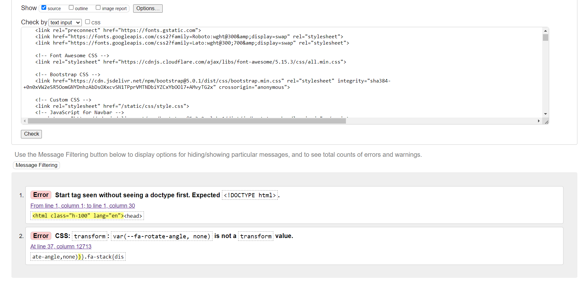 | 1 error present on all pages - it comes from the fontawesome kit: transform: var(--fa-rotate-angle, none)|
| tournament/templates/tournament | tournament_list.html | 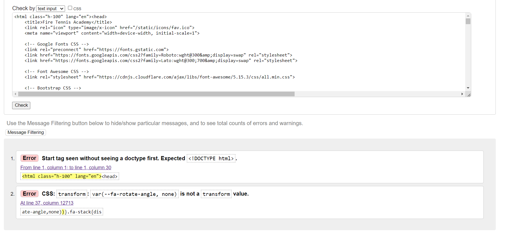 | 1 error present on all pages - it comes from the fontawesome kit: transform: var(--fa-rotate-angle, none)|

While going through validation and testing I realised that I did not follow standard normalisation procedures, since I had used ID's to style different elements which makes it bad pratice, after that I fixed the html for the project thus resulting in only the problems mentioned above which one is just not adding the "<!DOCTYPE html>" tag on the validator, but ensured it is present on the document.

Below you will be able to see some of the problems that occured with duplication of ID. I also did not put assign an alt value to the images before. [bad practice html](documentation/testing/Duplication%20of%20ID.png)

### CSS

As recommended, [CSS Jigsaw Validator](https://jigsaw.w3.org/css-validator) was used to validate the css file.

| Directory | File | Screenshot | Notes |
| --- | --- | --- | --- |
| static/css | style.css | 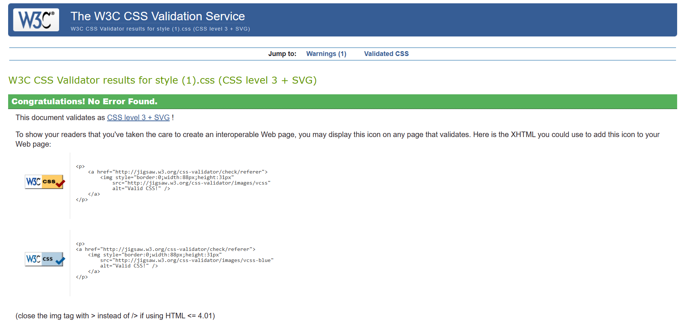| No errors |

### Python

As recommended by the programme, [CI Python Linter](https://pep8ci.herokuapp.com) was used for Python validation.

| Directory | File | Screenshot | Notes |
| --- | --- | --- | --- |
| tennisacademy | urls.py |  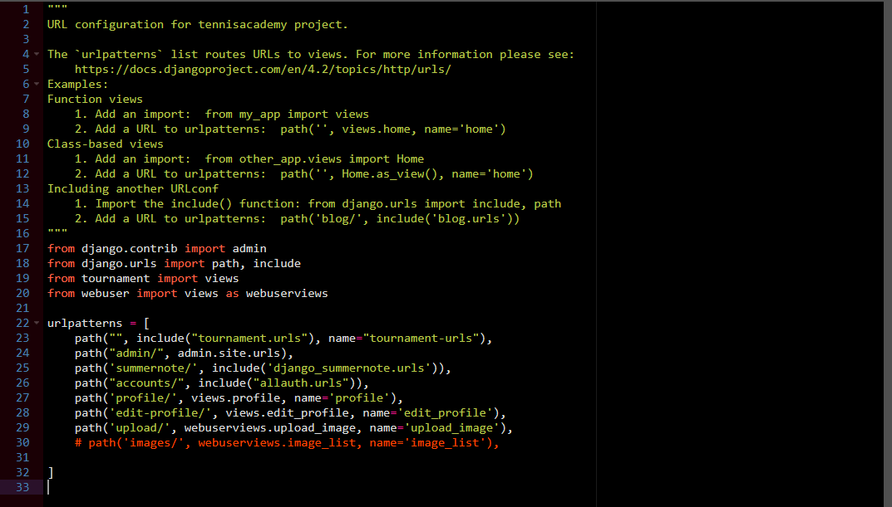 |
| tournament | models.py |  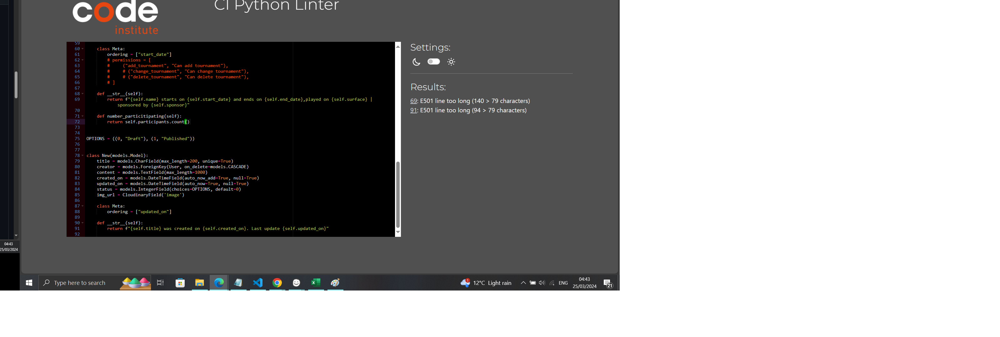 |
| tournament | forms.py |  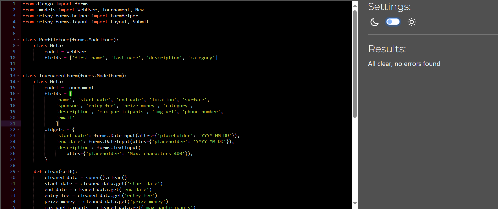 |
| tournament | urls.py |  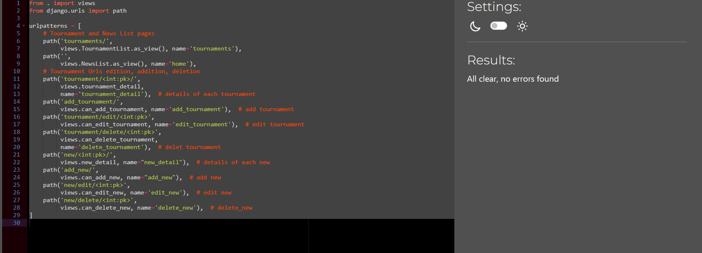 |
| tournament | views.py |  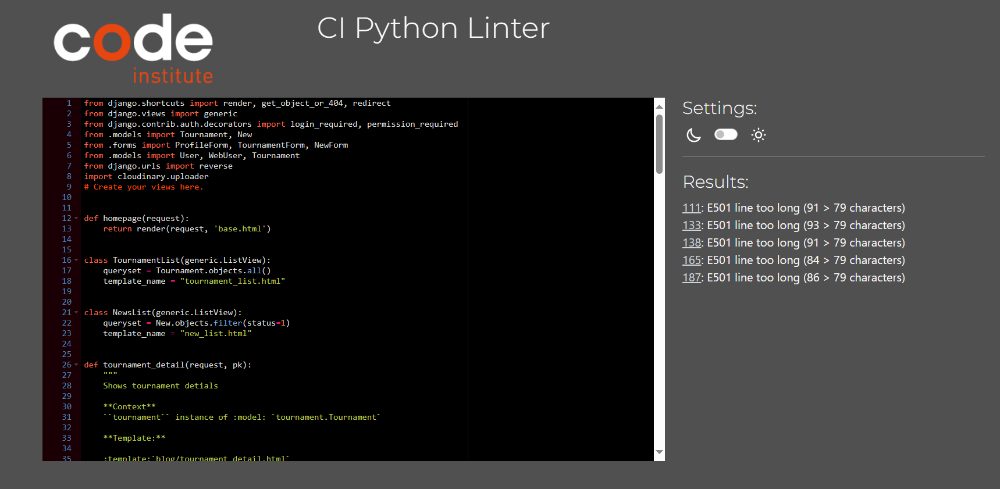 | Only errors with length |
| tournament | admin.py |  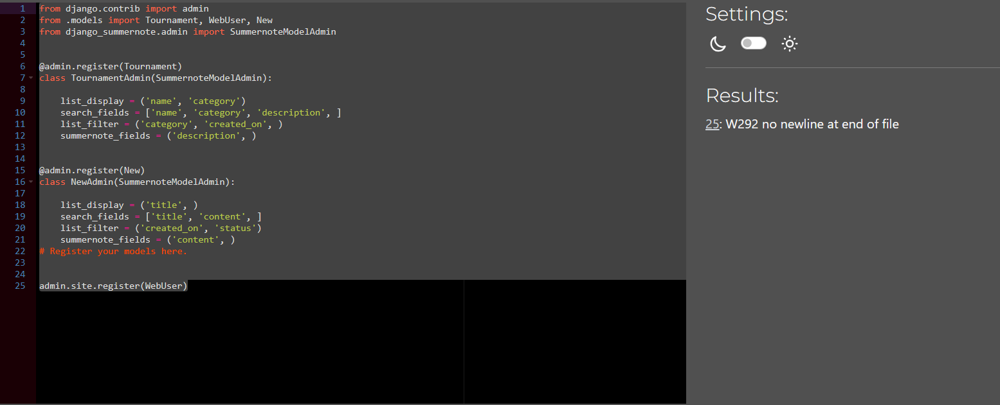 |

### No JavaScript was used for this project apart from the predetermined script for the navbar.

## Browser Compatibility

I've tested my deployed project on the main 3 browsers to check for compatibility issues.

| Browser | Screenshot | Intended Appearance | Intended Responsivity |
| --- | --- | --- | --- |
| Chrome| 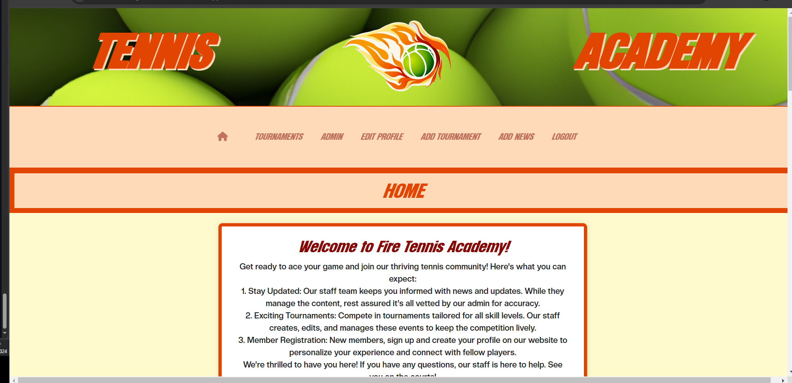 | Good | Good |
| Firefox| 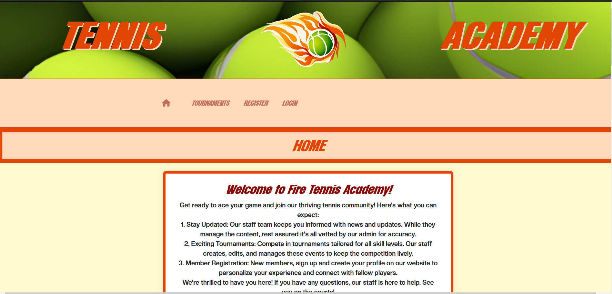 | Good | Good |
| Edge| 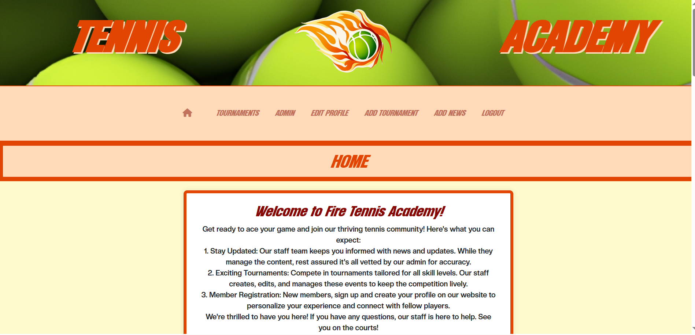 | Good | Good |

## Lighthouse Audit

Lighthouse Audit tool was used to test the deployed proyect. Overall, the website performed better on deskptop but sacrificed accesibility.

However, there is only one parameter that is low on mobile, which is the performance, this can be improved by reducing the size of the images(compression), eliminate render-blocking resources and reducing resources overall that slow down the loading times.

The website performed on average with the parameters shown as follows:

### Phone
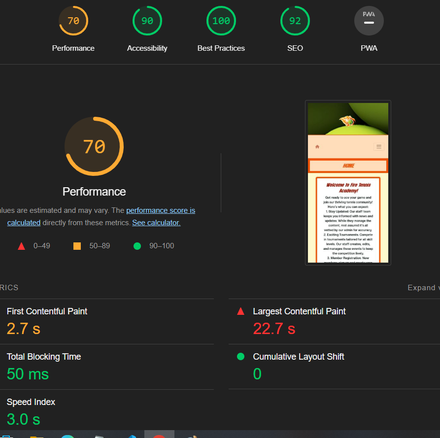

### Desktop
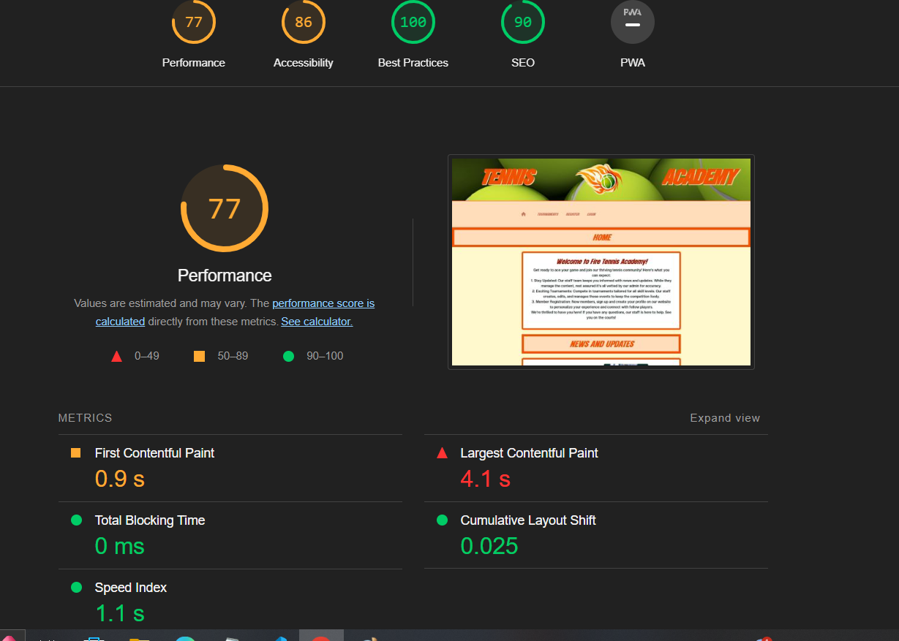

## Defensive Programming

Defensive was carried to ensure a smoother experience on the website. The following tables show as follows.

## Responsiveness

The responsiveness tests the layout flexibility to adapt smoothly to different screen sizes.

In this case, it was tested by using Google Dev Tools. To carry out the responsiveness test, it is necessary to:

1. Right click on the website
2. Click on inspect element.
3. Then in the middle of the page, it will show the screen size, and we can select the preferred option. In this case, responsive was chosen to drag and see how it behaves for different screen sizes.

